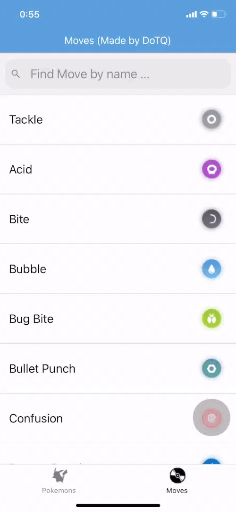

# rn-fe-some-demos 🐳


[](https://github.com/tquangdo/rn-fe-some-demos/issues/new)

## Usage
scan bar code on `expo go` appstore

## demos app
### 1/ momo & fb login
Learn how to use: **StatusBar**, **Expo Icons**, **Image**, **TextInput**, **TouchableOpacity**
### 2/ register form
Learn how to use: **KeyboardAwareScrollView**, **Formik**, **Yup**, **Alert**, **Separate Style**, **Separate Components**
### 3/ traffic lights
Learn how to use: **Transform**, **Platform**, **Dimension**, **Switch**, **TouchableHighlight**, **React Hook useState**
### 4/ music player
Learn how to use: **Expo AV**, **React Native Modal**, **React Hook useEffect**
### 5/ worldwide news
Learn how to use: **Connect JSON API**, **ActivityIndicator**, **Linking**, **Lodash**
### 6/ rock paper scissors
Learn how to use: **Animations**, **React Hook useRef**
### 7/ pokedex
Learn how to use: **React Native Elements**, **React Navigation**, **React Native Progress**, **React Hook useEffect with Cleanup**
************************

### 8/ flatlist
CRUID REST API: "be/Server.js"
```js
const MOCKAPI_URI = 'https://5edc676811cb1d001665ce13.mockapi.io/dotq/list_all_foods';
```
************************


### 9/ firebase
************************

